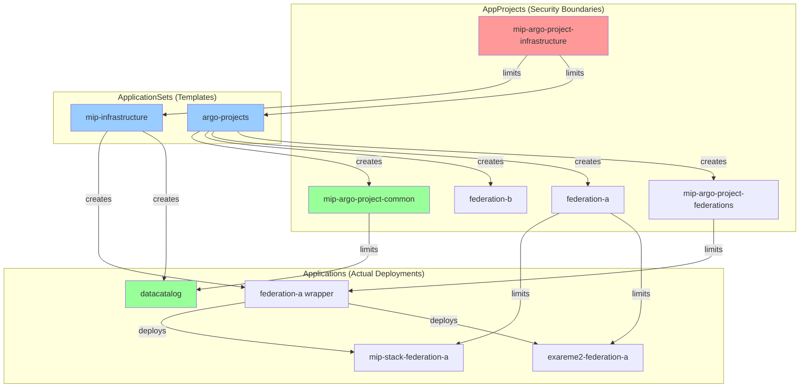
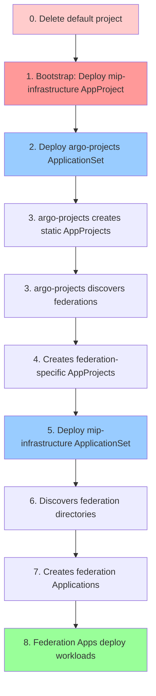

# MIP Infrastructure

This repository contains the GitOps infrastructure configuration for the Medical Informatics Platform (MIP), designed for managing federations across multiple clusters. The infrastructure uses Argo CD for continuous deployment and Kustomize for configuration management.

---
> **⚠️ WARNING: Deployment Instructions for users outside MIP Team**
>
> If you want to deploy this repository, please refer to the [deployments/README.md](deployments/README.md) for  deployment instructions.
---

## 🌟 Overview

mip-infra provides a scalable and flexible approach to deploying MIP federations in a managed cluster environment. It follows a GitOps pattern where all infrastructure and application configurations are defined in this repository and continuously deployed using Argo CD.

Key components:

- **Federation Management**: Easily deploy and manage multiple federations (data-sharing networks)
- **Dynamic AppProject Generation**: Automatically creates federation-specific AppProjects for enhanced security isolation
- **Dual-ArgoProject Architecture**: Federation wrappers and other high level Argo-projects use `mip-federations` project, while workload apps use federation-specific projects (e.g., `federation-a`)
- **Application Deployment**: Common applications like exareme2 and mip-stack shared across federations
- **Multi-Cluster Support**: Deploy to local, hybrid, or multiple clusters from a single configuration


## 🧭 **Argo CD Fundamentals**

For those new to Argo CD, here are the key concepts used in this repository:

### **GitOps Workflow**

- **GitOps**: Your Git repository is the "source of truth" for what should be deployed
- **Continuous Sync**: Argo CD continuously watches this repository and ensures your cluster matches what's defined in Git
- **Declarative**: You declare "what you want" (YAML configs) rather than "how to deploy it" (imperative scripts)

### **Core Argo CD Resources**


| Resource           | Purpose                                                    | Example in This Repo                            |
| -------------------- | ------------------------------------------------------------ | ------------------------------------------------- |
| **Application**    | Deploys a single app/service from Git to Kubernetes        | `datacatalog.yaml`, `federation-a.yaml`         |
| **ApplicationSet** | Template that auto-generates multiple Applications         | `mip-infrastructure.yaml`, `argo-projects.yaml` |
| **AppProject**     | Security boundary that controls what an Application can do | `mip-argo-project-infrastructure`, `federation-a` |

### **Why AppProjects Matter**

- **Security Isolation**: Each project has its own permissions (which repos, namespaces, resource types)
- **Multi-Tenancy**: Different teams/federations can't interfere with each other
- **Principle of Least Privilege**: Applications only get the minimum permissions they need

### **This Repository's Approach**

- **Bootstrap Pattern**: Start with minimal permissions, then auto-generate everything else
- **Self-Managing**: Argo CD manages its own configuration (ApplicationSets create Applications, which create AppProjects)
- **Federation-Aware**: Each data federation gets its own isolated AppProject automatically

### **Visual: How Everything Connects**



## 🏗️ Architecture

```
mip-infra/
├── base/                 # Core ApplicationSet configurations 
│   ├── mip-infrastructure/mip-infrastructure.yaml # Main ApplicationSet that discovers and deploys applications
│   └── argo-projects.yaml # ApplicationSet that manages all AppProjects (static ones + dynamic federation)
├── projects/             # AppProject definitions for security scoping
│   ├── mip-infrastructure.yaml # Core infrastructure project (bootstrap)
│   ├── static/                 # Isolated static AppProjects (prevents conflicts)
│   │   ├── mip-federations/    # Federation wrapper applications project
│   │   ├── mip-shared-apps/    # Shared applications project  
│   │   └── mip-common/         # Common resources project
│   └── templates/
│       └── federation/         # Helm template for dynamic federation-specific AppProjects
│           ├── Chart.yaml
│           ├── values.yaml
│           └── templates/appproject.yaml
├── common/                # Common/shared resources used across the platform
│   ├── datacatalog/       # Data catalog application
├── deployments/           # All deployment configurations  
│   ├── shared-apps/       # Template applications (federation-neutral)
│   │   ├── exareme2/      # Exareme2 application template
│   │   └── mip-stack/     # MIP stack application template
│   ├── local/             # Configurations for local deployments
│   │   └── federations/   # Federation-specific configurations
│   │       └── federation-A/ # Example federation
│   │           ├── customizations/ # Federation-specific app customizations
│   │           ├── federation-a.yaml # Federation wrapper application
│   │           └── kustomization.yaml # Kustomize configuration
│   └── hybrid/            # Configurations for hybrid deployments (skeleton to be added later)
├── .githooks/             # Git hooks (e.g., pre-commit)
└── LICENSE                # Apache 2.0 License
```

## Argo AppProject Architecture

The system uses a **dual-project security model** for enhanced isolation:

### Static AppProjects

- **`mip-argo-project-infrastructure`**: Core infrastructure components and ApplicationSets
- **`mip-argo-project-federations`**: Federation wrapper applications (e.g., `federation-a.yaml`)
- **`mip-argo-project-shared-apps`**: Template applications in `/shared-apps` (unused in current architecture)
- **`mip-argo-project-common`**: Cluster-wide resources like monitoring, security, datacatalog

### Dynamic Federation AppProjects

- **`federation-a`, `federation-b`, etc.**: Auto-generated per federation via `base/argo-projects.yaml`
- **Workload applications** (exareme2, mip-stack customizations) use these federation-specific projects
- **Enhanced security**: Each federation is isolated with its own RBAC and resource permissions

### Project Usage Pattern

```yaml
# Federation wrapper (uses mip-argo-project-federations)
federation-a.yaml:
  project: mip-argo-project-federations

# Workload apps (use federation-specific project)  
exareme2-kustomize.yaml:
  project: federation-a

mip-stack-kustomize.yaml:
  project: federation-a
```

## **Deployment Workflow**

Understanding the step-by-step flow helps debug issues:



**What's happening:**

1. **Manual**: You remove the default project (security hardening)
2. **Manual**: You create the bootstrap `mip-infrastructure` AppProject
3. **Manual**: You create the `argo-projects` ApplicationSet
4. **Automatic**: Argo CD discovers your federations and creates all AppProjects
5. **Manual**: You deploy the main `mip-infrastructure` ApplicationSet
6. **Automatic**: Everything else deploys automatically in a GitOps manner

## 🚀 Getting Started

### Prerequisites

- Kubernetes cluster running Argo CD
- `kubectl` CLI installed and configured
- `argocd` CLI installed (optional but recommended)
- SSH access to the repository configured in Argo CD

### 🔐 Remote Access (VPN/SSH)

If you are not on the same network as the cluster, you need to tunnel your traffic.

#### Option A: SOCKS Proxy (Recommended for `kubectl`)
This routes all your traffic through the jump host.

1. **Open Tunnel**:
   ```bash
   ssh -D 1080 -C -q -N <user>@<jump-host>
   ```
2. **Configure Environment**:
   ```bash
   export HTTPS_PROXY=socks5://127.0.0.1:1080
   ```

#### Option B: Port Forward + Hosts (Recommended for `argocd` CLI / UI)
This tricks your local machine into thinking `localhost` is the remote server, while preserving the hostname for Ingress routing.

1. **Update `/etc/hosts`**:
   ```bash
   # Add this line
   127.0.0.1 argocd.mip-tds.chuv.cscs.ch
   ```
2. **Open Tunnel (Sudo required for port 443)**:
   ```bash
   sudo ssh -L 443:argocd.mip-tds.chuv.cscs.ch:443 <user>@<jump-host>
   ```
3. **Login**:
   ```bash
   argocd login argocd.mip-tds.chuv.cscs.ch:443 --insecure --grpc-web
   ```

### Initial secrets:

The following secrets must exist in the cluster before or after running this repository's setup scripts. If you run it after, creation will hang until these are present.

| Secret | Namespace | Use |
| --- | --- | --- |
| `keycloak-credentials` | `mip-common-datacatalog` | Your EBRAINS Keycloak tenant secret |
| `keycloak-credentials` | `federation-X` | Your EBRAINS Keycloak tenant secret, must be repeated for all federation's namespace |
| `mip-secret` | `federation-X` | A different mip-secret object must be created for all federation's namespace |

The `mip-secret` is composed in this way:
```
apiVersion: v1
kind: Secret
metadata:
  name: mip-secret
  namespace: NAMESPACE_CHANGEME
type: Opaque
data:
  gateway-db.DB_ADMIN_USER: CHANGEME_TO_A_UNIQUE_ONE_PER_FEDERATION
  gateway-db.DB_ADMIN_PASSWORD: CHANGEME_TO_A_UNIQUE_ONE_PER_FEDERATION

  portalbackend-db.DB_ADMIN_USER: CHANGEME_TO_A_UNIQUE_ONE_PER_FEDERATION
  portalbackend-db.DB_ADMIN_PASSWORD: CHANGEME_TO_A_UNIQUE_ONE_PER_FEDERATION
  portalbackend-db.PORTAL_DB_USER: CHANGEME_TO_A_UNIQUE_ONE_PER_FEDERATION
  portalbackend-db.PORTAL_DB_PASSWORD: CHANGEME_TO_A_UNIQUE_ONE_PER_FEDERATION

  keycloak-db.POSTGRES_USER: CHANGEME_DEPRECATED
  keycloak-db.POSTGRES_PASSWORD: CHANGEME_DEPRECATED

  keycloak.KEYCLOAK_USER: CHANGEME_DEPRECATED
  keycloak.KEYCLOAK_PASSWORD: CHANGEME_DEPRECATED
```

> See the next section for a **no-logging** way to generate these secrets across all `federation-*` namespaces and `mip-common-datacatalog`.


###  Generate Required Secrets (No Logging)

Use the existing script `scripts/gen_secrets.sh` to create all required secrets **without leaking credentials**.

**What the script does**
- Creates `keycloak-credentials` (with `client-id`, `client-secret`) in:
  - `mip-common-datacatalog`
  - **every** `federation-*` namespace (same values for all federations)
- Creates a unique `mip-secret` **per** federation with autogenerated 24-character alphanumeric values for all required keys (deprecated keys included for compatibility).

**Prerequisites**
- `bash`, `kubectl` in PATH
- RBAC permissions to create secrets in target namespaces
- Your current `kubectl` context points to the right cluster

**Run (interactive, no logging)**
```bash
chmod +x scripts/gen_secrets.sh
./scripts/gen_secrets.sh
```

### Setup

0. Clone and checkout the repository:

```bash
# Clone the repository 
git clone https://github.com/NeuroTech-Platform/mip-infra.git
cd mip-infra

# Checkout the desired branch (main for production, or your feature branch)
git checkout main  
```

1.  Deploy Argo as described in [argo-setup/README.md](argo-setup/README.md), then follow the steps below.


2. Add the deployment repository to Argo CD and apply the RBACs:

```bash
argocd repo add git@github.com:NeuroTech-Platform/mip-deployments.git \
  --ssh-private-key-path ./argocd-remote-key \
  --name mip-infra

kubectl apply -f base/mip-infrastructure/rbac/nginx-public-rbac.yaml
kubectl apply -f base/mip-infrastructure/rbac/submariner-rbac.yaml
kubectl apply -f base/mip-infrastructure/rbac/eck-beats-rbac.yaml
```


3. **IMPORTANT:** Bootstrap deployment (two-step process):

```bash

# Step 2: Deploy bootstrap AppProject (mip-infrastructure only)
argocd proj create -f projects/mip-infrastructure.yaml --grpc-web --upsert

# Step 3: Deploy argo-projects ApplicationSet (manages all other AppProjects)
CURRENT_BRANCH=$(git rev-parse --abbrev-ref HEAD)
SAFE_BRANCH_NAME=$(echo "$CURRENT_BRANCH" | sed 's/[^a-zA-Z0-9]/-/g')

argocd app create ${SAFE_BRANCH_NAME}-argo-projects \
  --repo https://github.com/NeuroTech-Platform/mip-infra.git \
  --path base \
  --revision $CURRENT_BRANCH \
  --dest-server https://kubernetes.default.svc \
  --dest-namespace argocd-mip-team \
  --sync-option CreateNamespace=true \
  --project mip-argo-project-infrastructure \
  --grpc-web

# Sync the application 
argocd app sync ${SAFE_BRANCH_NAME}-argo-projects

# Verify bootstrap is working
kubectl get appprojects -n argocd-mip-team
# Should show: mip-infrastructure (immediately), others will appear as argo-projects syncs
```

4. Deploy the main infrastructure:

```bash

# Create the infrastructure application using Argo CD CLI
argocd app create ${SAFE_BRANCH_NAME}-infra-clusterset \
  --repo https://github.com/NeuroTech-Platform/mip-infra.git \
  --path base/mip-infrastructure \
  --revision $CURRENT_BRANCH \
  --project mip-argo-project-infrastructure \
  --dest-server https://kubernetes.default.svc \
  --dest-namespace argocd-mip-team

# Sync the application 
argocd app sync ${SAFE_BRANCH_NAME}-infra-clusterset

# Get details about the infrastructure application
argocd app get ${SAFE_BRANCH_NAME}-infra-clusterset
```

> **Heads up:** If Applications hang waiting for secrets, follow **Generate Required Secrets (No Logging)** above, then resync.
>
> Additionally, and due to a bug, it is currently necessary to run `kubectl delete -n federation-x jobs create-dbs` for all federations **after** `portalbackend-xxx` pod is 1/2 for the deployment to finish.

5. Verify the deployment:

```bash
# Check AppProjects are deployed (should show static projects)
kubectl get appprojects -n argocd-mip-team

# Check the infrastructure application status
argocd app get ${SAFE_BRANCH_NAME}-infra-clusterset

# Check all applications (should see federation applications being created)
argocd app list

# Verify argo-projects ApplicationSet is working (generates all AppProjects)
# This should show applications like: mip-argo-project-federations-app, mip-argo-project-federation-a
argocd app list | grep -E "(mip-argo-project-|argo-project-)"

# Check for all AppProjects (static + dynamic federations)
kubectl get appprojects -n argocd-mip-team
# Should show: mip-argo-project-infrastructure, mip-argo-project-federations, mip-argo-project-shared-apps, mip-argo-project-common, federation-a, etc.

# Monitor federation-specific AppProjects being created dynamically
kubectl get appprojects -n argocd-mip-team --watch

# Check the argo-projects ApplicationSets (generates all AppProjects)
argocd app get feat-argo-project-scoping-argo-projects  # Replace with your branch name
```

## 🌱 Branch-Based Development

To facilitate development on feature branches without impacting the `main` configuration, we use a pre-commit hook and a manual update process.

### 1. Install the Pre-commit Hook

This hook helps prevent accidental commits of `main` branch configurations when working on a feature branch.

```bash
cp .githooks/pre-commit .git/hooks/
chmod +x .git/hooks/pre-commit
```

### 2. Working on a Feature Branch

When you create and switch to a new branch (e.g., `feature/my-new-thing`):

a. **Modify `base/mip-infrastructure/mip-infrastructure.yaml` (if applicable)**:
If your changes require the ApplicationSet in `base/mip-infrastructure/mip-infrastructure.yaml` to point to your current branch, you must manually update these fields:
- `spec.generators[0].git.revision` (or similar paths if you have multiple generators)
- `spec.template.spec.source.targetRevision`
Change `main` to your current branch name (e.g., `feature/my-new-thing`).

b. **Commit Your Changes**:
The pre-commit hook will run. If it finds `revision: main` or `targetRevision: main` in `base/mip-infrastructure/mip-infrastructure.yaml` while you are on a feature branch, it will block the commit and guide you to make the necessary changes.

### 3. Deploying Your Feature Branch

To deploy the configuration from your current feature branch, follow the same deployment order (AppProjects first, then infrastructure):

```bash
# Verify AppProjects exist
kubectl get appprojects -n argocd-mip-team

# Get your current branch name
CURRENT_BRANCH=$(git rev-parse --abbrev-ref HEAD)

# Sanitize the branch name for use in Argo CD application names
SAFE_BRANCH_NAME=$(echo "$CURRENT_BRANCH" | sed 's/[^a-zA-Z0-9]/-/g')

# Create and sync the Argo CD application for your branch
argocd app create ${SAFE_BRANCH_NAME}-infra-clusterset \
  --repo https://github.com/NeuroTech-Platform/mip-infra.git \
  --path base/mip-infrastructure \
  --revision $CURRENT_BRANCH \
  --project mip-argo-project-infrastructure \
  --dest-server https://kubernetes.default.svc \
  --dest-namespace argocd-mip-team

argocd app sync ${SAFE_BRANCH_NAME}-infra-clusterset

# Monitor your branch-specific application
argocd app get ${SAFE_BRANCH_NAME}-infra-clusterset
```

> **Note**: This command deploys the content of the `base` directory, using the version of files from your *current feature branch* (`$CURRENT_BRANCH`). If `base/mip-infrastructure/mip-infrastructure.yaml` is an ApplicationSet, this means you are deploying a version of that ApplicationSet that should ideally be configured to sync from your feature branch.

### 4. Cleaning Up Your Feature Branch Deployment

Once you are done with your feature branch and have merged your changes (or decided to discard them), delete the Argo CD application associated with your branch:

```bash
# Replace <your-feature-branch-name> with the actual name of your branch
SAFE_BRANCH_NAME=$(echo "<your-feature-branch-name>" | sed 's/[^a-zA-Z0-9]/-/g')

argocd app delete ${SAFE_BRANCH_NAME}-infra-clusterset --yes
```

### Adding a New Federation

1. Create a new directory under `deployments/local/federations/` (e.g., `federation-B/`)
2. Copy the kustomization.yaml and customizations from an existing federation
3. Update the `namePrefix` in kustomization.yaml to match your federation name
4. Update customization patches with your federation-specific values
5. If `base/mip-infrastructure/mip-infrastructure.yaml` is an ApplicationSet, it should automatically discover and deploy the new federation once your changes are on the tracked branch.

### Adding a New Cluster

To deploy federations to a new Kubernetes cluster (assuming `base/mip-infrastructure/mip-infrastructure.yaml` is an ApplicationSet):

1. Add the new cluster to Argo CD
2. Add a new entry to the `list` generator in `base/mip-infrastructure/mip-infrastructure.yaml`:

```yaml
- cluster: https://your-new-cluster.example.com
  namespace: argocd-mip-team
  clusterName: your-cluster-name
```

3. Commit and push this change to the branch your main ApplicationSet is tracking (e.g., `main`).

### Customizing Applications

Each federation can customize shared applications by:

1. Editing the values files in `deployments/local/federations/<federation>/customizations/`
2. Modifying the appropriate patch files (e.g., `exareme2-kustomize.yaml`)

### Adding New Applications

To add a new shared application:

1. Create a directory for the application in `deployments/shared-apps/`
2. Add the application's Kubernetes manifests or Helm charts
3. Include the application in each federation's kustomization.yaml as needed

## 🔍 Troubleshooting

### **Argo CD Debugging Basics**

**Check Application Status:**

```bash
# List all applications and their health
argocd app list

# Get detailed info about a specific app
argocd app get <app-name>

# Check sync status and errors
argocd app diff <app-name>
```

**Understanding Argo CD Status:**

- **🟢 Synced + Healthy**: Everything working perfectly
- **🟡 OutOfSync**: Git doesn't match cluster (usually fixable with sync)
- **🔴 Degraded**: Application deployed but not working properly
- **❌ Failed**: Deployment failed (check logs)

### **Known Possible Issues**

Common issues and solutions:

- **Application fails to create**: Ensure the branch name and path are correct. If you're having permission issues, check your ArgoCD configuration.
- **Permission denied when syncing infrastructure**: This happens when AppProjects don't exist yet. **Solution**: Follow the three-step bootstrap process: (1) Delete `default` project, (2) Deploy `mip-infrastructure` AppProject, (3) Deploy `argo-projects` ApplicationSet before creating the main infrastructure application.

- **"Cannot delete default project" error**: Some Argo CD instances have the default project protected. **Solution**: Either skip the deletion step (less secure) or use `argocd proj delete default --cascade` to force deletion if you have admin rights.
- **Application created but stuck in "OutOfSync" status**: Try manually syncing with `argocd app sync <app-name>`. Check the Application status with `argocd app get <app-name>` for any error messages. Ensure the `revision` in your app points to a branch that exists and contains the specified `--path`.
- **Application fails to sync**: Check the Argo CD logs. This often points to issues within your manifests (e.g., incorrect YAML, Kustomize errors, Helm template errors) or problems with the target cluster.
- **Helm template errors in values files**: Errors like `invalid map key: map[interface {}]interface {}{".Values.controller.cleanup_file_folder":interface {}(nil)}` indicate improperly formatted YAML in a values file. Check for:

  - Template expressions used as map keys (which is invalid)
  - Incorrect indentation or formatting
  - Missing quotes around special characters
    Fix the errors in the referenced values file.
- **Values not being applied**: Verify the patch files include all required fields and correctly reference values files.
- **Missing namespaces**: Ensure your kustomization files or applications create required namespaces.
- **Branch not found / Path not found**: When creating an Argo CD Application, ensure the `--revision` (branch/tag/commit) and `--path` exist in your repository.
- **Pre-commit Hook Not Working**: Ensure you've copied the hook to `.git/hooks/pre-commit` and made it executable (`chmod +x .git/hooks/pre-commit`).

## 📚 **Quick Reference Glossary**


| Term               | Definition                                                                                      |
| -------------------- | ------------------------------------------------------------------------------------------------- |
| **ApplicationSet** | Template that auto-generates multiple Applications based on patterns                            |
| **AppProject**     | Security boundary defining what repositories, clusters, and resources an Application can access |
| **Federation**     | A data-sharing network of medical institutions (federation-A, federation-B, etc.)               |
| **GitOps**         | Deployment approach where Git repository is the source of truth                                 |
| **Kustomize**      | Tool for customizing Kubernetes YAML without templates                                          |
| **Sync**           | Process of making the cluster match what's defined in Git                                       |
| **OutOfSync**      | State where cluster doesn't match Git (usually requires manual sync)                            |
| **Self-Heal**      | Automatic correction when someone manually changes cluster resources                            |
| **Prune**          | Deletion of resources that exist in cluster but not in Git                                      |

## 📄 License

This project is licensed under the Apache License 2.0 - see the [LICENSE](LICENSE) file for details.

## Acknowledgements

This project has received funding from the European Union’s Horizon 2020 Framework Partnership Agreement No. 650003 (Human Brain Project), and from the European Union’s Horizon Europe research and innovation programme under Grant Agreement No. 101147319 (EBRAINS 2.0). This work was also supported by the Swiss State Secretariat for Education, Research and Innovation (SERI) under contract No. 23.00638 (EBRAINS 2.0).

## 🔗 Related Projects

- [MIP Deployment](https://github.com/HBPMedical/mip-deployment) - MIP Stack repository
- [Exareme2](https://github.com/madgik/exareme2) - Distributed analytics engine used by MIP
- [Datacalog](https://github.com/madgik/datacatalog) - Datacatalog for the MIP
