# MIP Security Network Policies

This module implements network isolation policies for MIP federations and common namespaces to ensure secure, isolated communication between different components of the MIP infrastructure.

## Overview

The security policies implement a **zero-trust network model** where:
- Each federation namespace is isolated and can only communicate within itself
- Common namespaces are accessible by federation namespaces for shared services
- DNS access to `kube-system` is maintained for cluster functionality
- ArgoCD management access is preserved
- External HTTP/HTTPS access is allowed for container registries and APIs

## Architecture



The diagram above shows the network isolation architecture with:

- **Federation Namespaces**: Auto-discovered and isolated from each other
- **Common Services**: Shared resources with controlled access 
- **Access Control Switches**: Type-based configuration for federation access
- **System Services**: Always accessible for DNS and external connectivity
- **Security Boundaries**: Default-deny with explicit allow rules

## Network Policy Rules

### Federation Namespaces (`federation-*`)

**Ingress (Allowed)**:
- Traffic from the same namespace
- Traffic from ArgoCD namespace (`argocd-mip-team`)

**Egress (Allowed)**:
- Traffic to the same namespace
- DNS queries to `kube-system` (UDP/TCP port 53)
- External HTTP (port 80) and HTTPS (port 443)

### Common Namespaces (`mip-common-*`)

**Ingress (Allowed)**:
- Traffic from the same namespace
- Traffic from federation namespaces (**controlled by access switches**, see Configuration)
- Traffic from ArgoCD namespace

**Egress (Allowed)**:
- Traffic to the same namespace
- DNS queries to `kube-system` (UDP/TCP port 53)
- External HTTP (port 80) and HTTPS (port 443)

## Configuration

The network policies use **auto-discovery** for federation namespaces and static configuration for common namespaces:

### **Auto-Discovery for Federation Namespaces**

Federation namespaces are **automatically discovered** from git repositories:
- **Local federations**: `deployments/local/federations/*`
- **Hybrid federations**: `deployments/hybrid/federations/*/mip-infrastructure`

### **Static Configuration for Common Namespaces**

Common namespaces are configured via `common-templates/values.yaml`:

```yaml
# Common namespaces that should be isolated
commonNamespaces:
  - mip-common-datacatalog
  - mip-common-monitoring
  - mip-common-security

# Federation access control (by TYPE, not specific namespaces)
federationAccess:
  local:
    enabled: false  # Default: false (more secure)
    allowedCommonNamespaces:
      # - mip-common-datacatalog
      # - mip-common-monitoring
  hybrid:
    enabled: false  # Default: false (more secure)
    allowedCommonNamespaces:
      # - mip-common-datacatalog
      # - mip-common-monitoring
```

### Federation Access Control

**Important**: Access control is **type-based** rather than namespace-specific:

- **Local federations** (`mip.federation-type: local`) have separate access controls
- **Hybrid federations** (`mip.federation-type: hybrid`) have separate access controls  
- By default, **all federation types cannot** access common namespaces (`enabled: false`)

To enable access:

1. **Enable by type**: Set `federationAccess.local.enabled: true` for all local federations
2. **Configure allowed namespaces**: List which common namespaces that federation type can access
3. **Apply changes**: Commit and push - ArgoCD will update the policies automatically

**Security Note**: The `mip-common-security` namespace should typically **not** be accessible by any federation type.

### Adding New Namespaces

#### **Federation Namespace (Auto-Discovery)**
Simply add the federation directory to the git repository:
- **Local federation**: Create `deployments/local/federations/federation-new/`  
- **Hybrid federation**: Create `deployments/hybrid/federations/federation-new/mip-infrastructure/`

The ApplicationSet will **automatically discover and apply** network policies!

#### **Common Namespace (Manual Configuration)**
1. Add to `commonNamespaces` list in `common-templates/values.yaml`
2. Optionally add to federation access lists
3. Commit and push - ArgoCD will automatically apply the policies

**Example: Enable local federations to access datacatalog**:
```yaml
federationAccess:
  local:
    enabled: true     # Enable ALL local federations
    allowedCommonNamespaces:
      - mip-common-datacatalog  # Allow access to datacatalog only
```

### Customizing Policies

You can customize the network policies by modifying:

- `values.yaml` - Namespace lists and global settings
- `templates/federation-network-policies.yaml` - Federation-specific rules
- `templates/common-network-policies.yaml` - Common namespace rules

## Deployment

The security policies are automatically deployed by the main `mip-infrastructure` ApplicationSet when it discovers the `common/security` directory.

### How It Works

1. **Federation Policies**: `federation-network-policies` ApplicationSet auto-discovers federations and creates individual network policy applications for each
2. **Common Policies**: `common-network-policies` Application deploys policies to all common namespaces

### Manual Deployment

If needed, you can deploy manually:

```bash
# Deploy the ApplicationSet and Application
kubectl apply -f common/security/nepol.yaml

# Sync the applications
argocd app sync federation-network-policies
argocd app sync common-network-policies

# Check auto-generated federation applications
argocd app list | grep netpol-
```

## Troubleshooting

### Network Connectivity Issues

If applications cannot connect after applying policies:

1. **Check policy application**:
   ```bash
   kubectl get networkpolicies -n <namespace>
   ```

2. **Verify namespace labels**:
   ```bash
   kubectl get namespace <namespace> --show-labels
   ```
   
   Ensure namespaces have the `name` label matching their namespace name.

3. **Test DNS resolution**:
   ```bash
   kubectl run test-dns --image=busybox --rm -it -- nslookup kubernetes.default
   ```

4. **Check ArgoCD access**:
   ```bash
   kubectl get pods -n argocd-mip-team
   ```

### Common Issues

- **DNS not working**: Ensure `kube-system` namespace has proper labels
- **ArgoCD can't sync**: Check ArgoCD namespace access rules
- **External dependencies failing**: Verify HTTP/HTTPS egress rules

## Security Considerations

- **Default Deny**: All traffic is denied by default unless explicitly allowed
- **Principle of Least Privilege**: Only necessary communication is permitted
- **Federation Isolation**: Federations cannot communicate with each other
- **Granular Common Access**: Federation access to common services is **disabled by default** and must be explicitly enabled
- **Federation Type Separation**: Local and hybrid federations have separate access controls
- **Management Access**: ArgoCD retains full management capabilities

## Monitoring

Monitor network policy effectiveness:

```bash
# Check denied connections (if using Falco or similar)
kubectl logs -n kube-system <falco-pod>

# View network policy events
kubectl get events --field-selector reason=NetworkPolicyDenied
``` 

